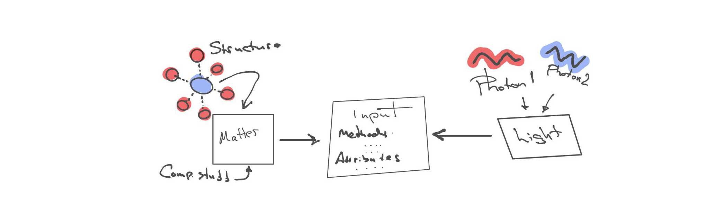

# Python Wrapper for OCEAN (FEFF) Code

A Python interface to the OCEAN package for X-ray Absorption Spectroscopy (XAS) calculations. This tool automates and simplifies running OCEAN simulations for materials analysis.

---
## Installation

Install the package using pip in your preferred Python environment:

```
pip install . 
```
---

## Code Structure

The following diagram illustrates the overall structure of the codebase:


---

## Input Object Structure

Input objects conform to the structure shown below, enabling flexible and customizable simulation setups:



---

## Optional Setup Instructions

### Installing Mamba (Optional)

[Mamba](https://mamba.readthedocs.io/en/latest/) is a fast package manager alternative to conda. You can install it to speed up environment creation and package installations:
```
mamba create -n ocean_env python=3.12
mamba activate ocean_env
```

---

## Compiling OCEAN within the Conda Environment

Clone the customized OCEAN fork repository :

```
git clone https://github.com/geonda/OCEAN/
cd OCEAN
```

### Required dependencies (install via conda or your system package manager):

mamba install make gfortran openmpi blas fftw scalapack mkl perl

### Adjust the `Makefile.arch` configuration

Create `Makefile.arch` in the source directory with your system-specific compiler options and paths (example for GCC + MPI with blas and fftw):

Replace `\${PREFIX}` with your conda environment path (`$CONDA_PREFIX`).

```
cat > Makefile.arch << EOF

Fortran compilers
FC = gfortran
MPIFORT = mpif90
PREFIX= 


Compiler flags
OPTIONS = -O2 -DBLAS -DMPI -D__OLD_MPI -cpp -fallow-argument-mismatch -ffree-line-length-512 -D__FFTW3

Linear algebra libraries
BLAS = -L${PREFIX}/lib -lblas -L${PREFIX}/lib -lscalapack

FFTW flags
FFTWI = -I${PREFIX}/include
FFTWL = -L${PREFIX}/lib -lfftw3

Install directory (used by Makefile install target)
INSTDIR = ${PREFIX}/bin

ESPRESSO_DIR = ${PREFIX}/bin/
PW_EXE = ${PREFIX}/bin/pw.x
PP_EXE = ${PREFIX}/bin/pp.x
PH_EXE = ${PREFIX}/bin/ph.x

ONCVPSP_DIR = /home/a.geondzhian/src/oncvpsp/
EOF
```

### Build and install OCEAN

```
make clean
make
make install PREFIX=${PREFIX}
```

---

## Compiling the Pseudopotential (PSP) Database

To support newer ONCVPSP pseudopotentials:

1. Download latest ONCVPSP sources from [https://github.com/jtv3/oncvpsp](https://github.com/jtv3/oncvpsp).
2. Set `ONCVPSP_DIR` in `Makefile.arch` accordingly:

``` 
ONCVPSP_DIR = /path/to/oncvpsp
```

3. After compiling the main OCEAN code, navigate to the PSP folder and run:

```
make database
```

to build the pseudopotential database.

---

## Contributing

Contributions, bug reports, and feature requests are welcome. Please open issues on GitHub or submit pull requests.

---

## License

MIT 

---

Link to the official ocean repository [OCEAN](https://github.com/times-software/OCEAN.git)
